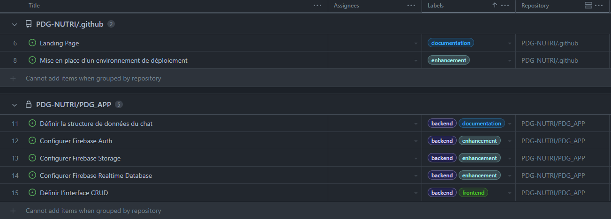
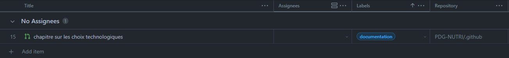
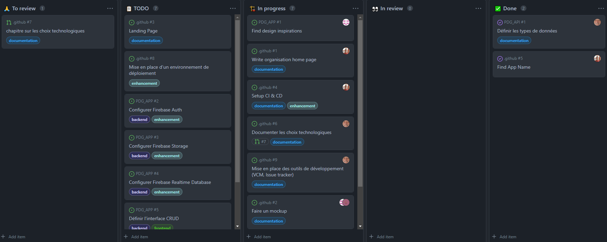
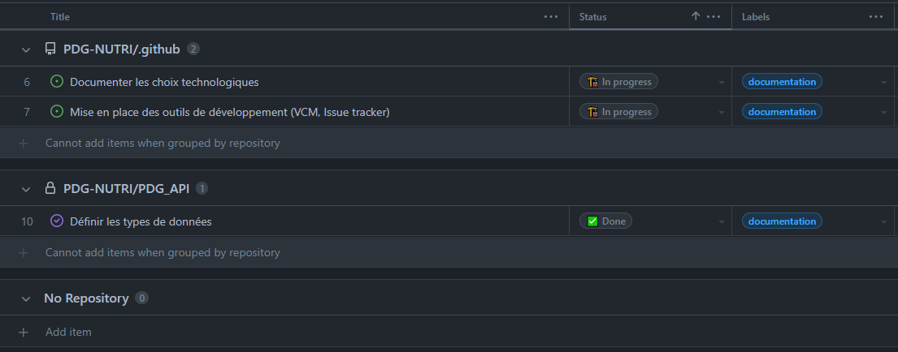

# OtCare 🥕

## Description du projet

OtCare est une application de suivi personnel diététique mettant en relation un client et son nutritioniste.

le but est de ...

## Landing page

Une landing page est un site Web vitrine. Il s’agit souvent d’une page pour présenter un produit, les fonctionnalités de celui-ci et l’équipe qui l’a réalisé. Sa seule utilité est de présenter le concept au grand public avant le lancement officiel. La landing page est souvent accrocheuse et accessible; on comprend vite le but du produit présenté.

[Page d'accueil](https://github.com/PDG-NUTRI)

## Mockup

Il a pour but de faire comprendre comment sera utilisé le produit final une fois qu’il sera développé. Il s’agit d’un prototype simplifié pour illustrer les interactions entre l’utilisateur et le produit final. Il permet de valider l’idée finale de l’application ou du site Web avant de commencer à la développer

[Mockup](https://www.figma.com/file/0gbE9gDHY1h7Hnc1fviPDz/PDG-Nutri?node-id=0%3A1)

## Schéma d’architecture

## Requirements fonctionnels

## Requirements non-fonctionnels

## Méthodologie de développement

## Choix technologiques
Pour le développement de l'application mobile, nous utilisons Flutter qui nous permet d'avoir une solution multiplateforme et d'obtenir rapidement une interface graphique sans difficulté.

Du côté backend, nous utilisons les services de Firebase. Nos données et fichiers sont stockées sur Firebase Storage. Les données liées au chat instantanée sont stockées sur Firebase Realtime Database. Notre système d'authentification est également géré à l'aide de Firebase Auth.
## Outils de développement
Nous utilisons GitHub comme gestionnaire de version pour ce projet. Nous avons crée une organisation Github qui possède deux dépôts. Le premier comporte tous les fichiers de documentations se rapportant directement au projet et le second contient notre application.

Pour le suivi des issues, nous utilisons Github project. Ce dernier est séparé en plusieurs vues pour facilité le traitement des tâches. Chaque issue possède alors : 
* Une personne assignée à sa réalisation.
* Une description de sa nature *(documentation, feature, correction de bug, ...)*.
* Un statut dépendant de son état actuel *(À faire, En cours, En attente d'une revue, En revue, Terminée)*
##### Vue Backlog

La première vue nous permet de créer de nouvelles issues et d'initialiser les différents paramètres qui lui sont liés.
##### Vue Reviews

Cette vue contient toutes les pull requests qui sont en attente d'une revue. Dans cet onglet on peut choisir de prendre en charge la revue de code lié à cette dernière.
##### Vue Kanban

Cette vue est un tableau Kanban simple qui permet de modifier l'état de complétions des tâches avec aise. C'est dans cette vue que l'on va choisir de prendre une tâche à faire pour la déplacer dans les tâches en cours, ou similairement, de décider de prendre le temps de faire la revue d'une pull request en attente.
##### Vue Planning

Cette dernière vue permet à chacun d'avoir une vue globale des tâches qui lui sont attribué.
## Intégration / Déploiement continu
